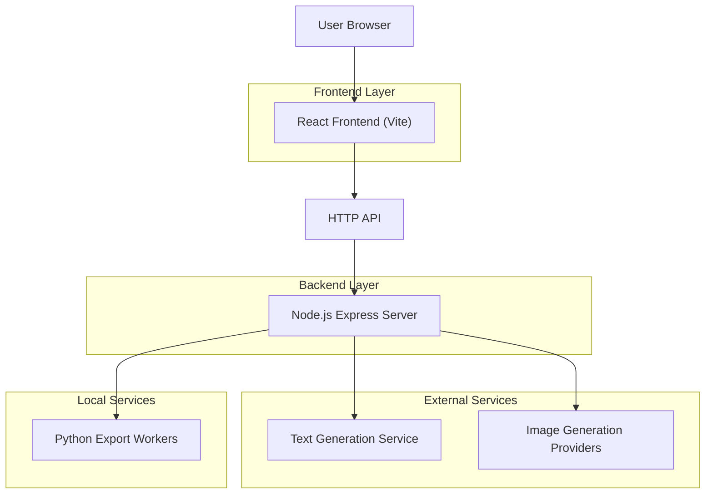
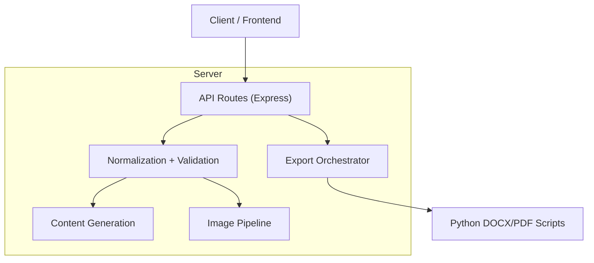

## 1.Architecture design


## 2.Technology Description
- Frontend: React@18 + react-router-dom + tailwindcss + lucide-react + react-markdown + remark-gfm
- Backend: Node.js + Express@5 + cors + dotenv
- Export: Python scripts for DOCX/PDF generation (invoked via child_process)

## 3.Route definitions
| Route | Purpose |
|---|---|
| / | Home page; entry point + CTA to create assignment |
| /form | Assignment Builder form; collects generation parameters and uploads |
| /result | Result Viewer; renders generated content and provides copy/download actions |

## 4.API definitions (If it includes backend services)
### 4.1 Core API
Generate assignment
```
POST /api/generate
```

Download exports
```
POST /api/download/:type   (type: pdf | docx)
```

Image generation monitoring
```
GET /api/monitoring/image-generation
```

### 4.2 Shared types (TypeScript-style)
```ts
type AssignmentLength = 'Short' | 'Medium' | 'Detailed'

type GeneratePayload = {
  topic: string
  subject: string
  level: string
  length: AssignmentLength
  pages: number
  style: string
  language: string
  instructions: string
  includeImages: boolean
  imageCount: number // 0..5
  images: string[] // data URIs
}

type ImageGenerationStatus = {
  status: 'ok' | 'attempted' | 'failed' | 'missing_key' | 'quota_exceeded' | string
  attempted?: boolean
  generated?: number
  retryAfterSeconds?: number | null
  errors?: { reason: string }[]
}

type GenerateResponse = {
  success: boolean
  data?: GeneratePayload & {
    seed: number
    content: string
    generatedImages: string[] // urls or data URIs
    imageGeneration: ImageGenerationStatus
  }
  errors?: string[]
  error?: string
}

type DownloadPayload = GeneratePayload & {
  content: string
  images: string[] // already-resolved image sources
}
```

## 5.Server architecture diagram (If it includes backend services)


## 6.Data model(if applicable)
No database is required for the current product scope (stateless generation + download).