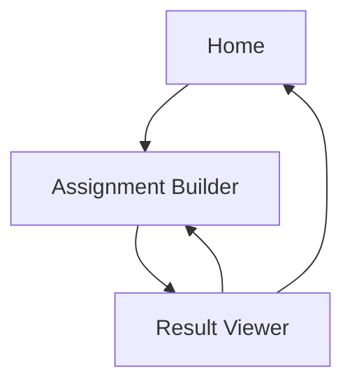

## 1. Product Overview
AI Assignment Writer is a web app that generates a formatted academic assignment from a short brief.
You use a single form to configure output (tone/length/images) and then copy or export the result.

## 2. Core Features

### 2.1 User Roles
| Role | Registration Method | Core Permissions |
|------|---------------------|------------------|
| Anonymous User | No signup | Can create an assignment, optionally include/upload images, view result, copy text, download PDF/DOCX |

### 2.2 Feature Module
Our redesign requirements consist of the following main pages:
1. **Home**: value proposition, primary CTA, lightweight trust/feature section.
2. **Assignment Builder**: structured input form, image inclusion + upload, validation, generate action + progress.
3. **Result Viewer**: readable “document” preview, image rendering, copy + export to PDF/DOCX, regeneration entry.

### 2.3 Page Details
| Page Name | Module Name | Feature description |
|---|---|---|
| Home | Hero + primary CTA | Navigate to Assignment Builder; communicate “no signup required” and expected outcome. |
| Home | Feature/benefit grid | Explain plagiarism claim, speed, academic tone, and visuals (existing claims only). |
| Assignment Builder | Form sections (Essentials / Format / Visuals / Instructions) | Collect topic, subject, level, length, tone, language, optional instructions; keep existing fields but redesign layout for scanability. |
| Assignment Builder | Image inclusion + upload | Toggle include images; select max image count (0–5); upload up to 5 images with preview; enforce current validation rules. |
| Assignment Builder | Validation + error handling | Show field-level errors and a single form-level error summary; prevent submit when invalid; keep messages human-readable. |
| Assignment Builder | Generation progress | Show loading state during `/api/generate`; communicate that images may be generated after content. |
| Result Viewer | Document preview | Render generated markdown content with stable typography; render inline images with captions (alt text). |
| Result Viewer | Status messaging | Display image-generation status and failure reasons when provided by API response. |
| Result Viewer | Actions toolbar | Copy text; download DOCX/PDF via `/api/download/:type`; start new assignment (back to form). |

## 3. Core Process
**Anonymous User Flow**
1. Open Home → review value prop → click “Create Assignment”.
2. Fill Assignment Builder form → (optional) enable images and/or upload images → submit.
3. Wait while assignment generates → land on Result Viewer.
4. Copy content or download DOCX/PDF → optionally start a new assignment.

