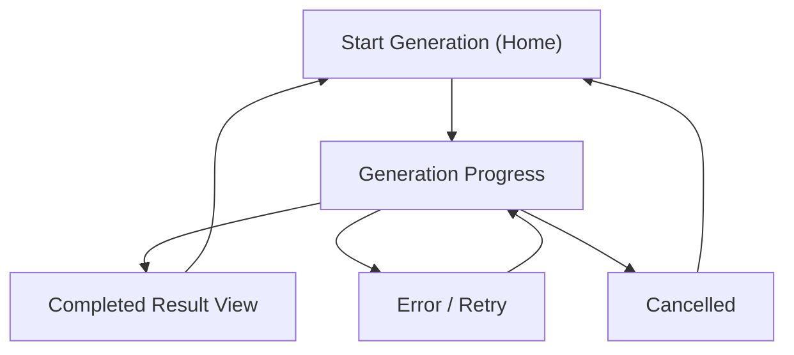

## 1. Product Overview
A real-time “Generation Progress” experience for long-running image generation.
You can track progress live via WebSocket/SSE, recover from failures with retries, and fall back to polling.

## 2. Core Features

### 2.1 User Roles
No role distinction (single end-user flow).

### 2.2 Feature Module
1. **Start Generation (Home)**: prompt + settings, start job, deep link to progress.
2. **Generation Progress**: real-time status, partial previews, retries, error recovery, fallback polling.

### 2.3 Page Details
| Page Name | Module Name | Feature description |
|---|---|---|
| Start Generation (Home) | Prompt & settings | Enter prompt and basic options (size/steps/style), then start a generation job. |
| Start Generation (Home) | Job creation | Create a job, show immediate “job created” confirmation, then navigate to progress page. |
| Generation Progress | Connection manager | Connect using WebSocket or SSE; automatically fall back to polling when streaming fails; show current mode (WS/SSE/Poll). |
| Generation Progress | Progress timeline | Show ordered progress events (queued → running → uploading → completed). Include timestamps and last-updated indicator. |
| Generation Progress | Preview & result | Display latest preview image(s) if available; on completion, show final image(s) with download/open actions. |
| Generation Progress | Retry controls | Allow manual retry on recoverable failures (retry job, or restart with same settings). Enforce max attempts and show attempt count. |
| Generation Progress | Cancel/stop | Allow cancel while running; show cancelled state and prevent further streaming updates. |
| Generation Progress | Error states & guidance | Explain error type (network/provider/timeout/validation), actionable next steps (edit prompt, retry later, switch to polling). |
| Generation Progress | User options | Copy shareable job link, restart with modified prompt, and view raw event details for support/debugging. |

## 3. Core Process
**End-user flow**
1. You enter a prompt and settings on Home and click Generate.
2. The system creates a job and sends you to the Generation Progress page.
3. The page tries to receive real-time events (WebSocket first, then SSE). If streaming is unavailable, it switches to polling.
4. If generation fails, you can retry (within limits) or edit the prompt and restart.
5. When complete, you download the result or start another generation.

