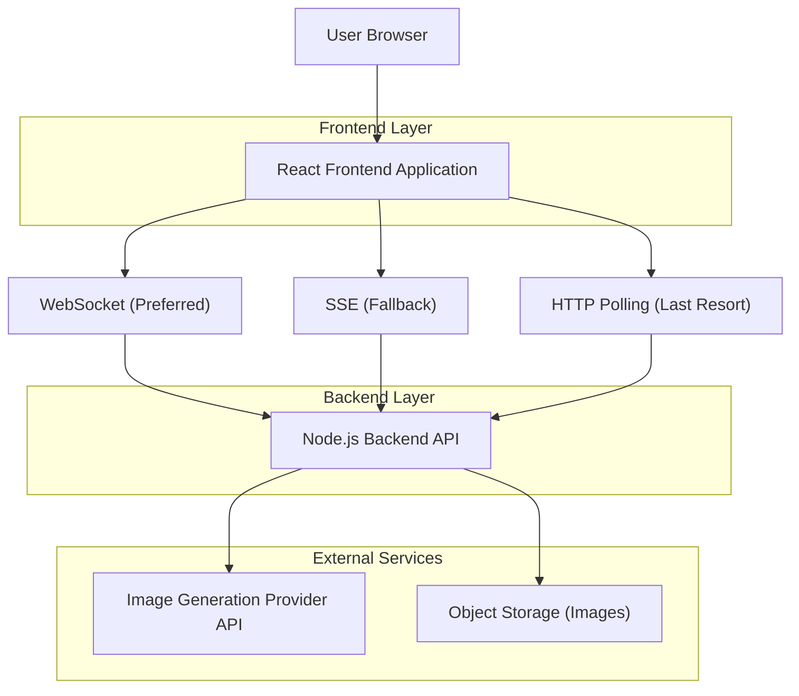
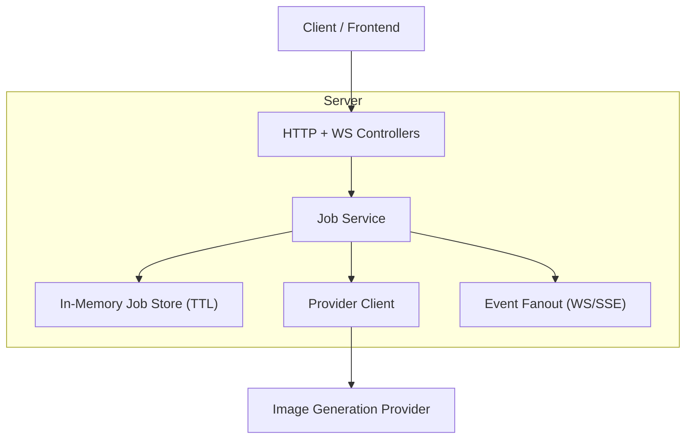

## 1.Architecture design


## 2.Technology Description
- Frontend: React@18 + TypeScript + vite
- Backend: Node.js + Express + ws (WebSocket) + SSE endpoint
- Database: None (ephemeral in-memory job state with TTL; optional future persistence)

## 3.Route definitions
| Route | Purpose |
|---|---|
| / | Home page to configure and start generation |
| /jobs/:jobId | Generation Progress page with live updates and result |

## 4.API definitions (If it includes backend services)
### 4.1 Core API
Create job
```
POST /api/jobs
```
Request
| Param Name| Param Type | isRequired | Description |
|---|---:|---:|---|
| prompt | string | true | Text prompt for image generation |
| options | JobOptions | false | Size/steps/style etc. |

Response
| Param Name| Param Type | Description |
|---|---|---|
| job | Job | Created job record |

Get job snapshot (for page load + polling)
```
GET /api/jobs/:jobId
```

Server-sent events stream (fallback streaming)
```
GET /api/jobs/:jobId/events
```

WebSocket stream (preferred)
```
WS /ws
```
Client sends: `{ "type": "subscribe", "jobId": "..." }`

Retry job
```
POST /api/jobs/:jobId/retry
```

Cancel job
```
POST /api/jobs/:jobId/cancel
```

### 4.2 Shared TypeScript types
```ts
type JobStatus =
  | "queued"
  | "running"
  | "uploading"
  | "completed"
  | "failed"
  | "cancelled";

type TransportMode = "ws" | "sse" | "poll";

type JobOptions = {
  size?: "512" | "768" | "1024";
  steps?: number;
  style?: string;
};

type ProgressEvent = {
  id: string;
  jobId: string;
  seq: number;
  ts: string; // ISO
  stage: JobStatus;
  message?: string;
  percent?: number; // 0..100 (best-effort)
  previewUrl?: string;
  error?: { code: ErrorCode; message: string; retryable: boolean };
};

type ErrorCode =
  | "NETWORK_DISCONNECTED"
  | "STREAM_UNAVAILABLE"
  | "PROVIDER_RATE_LIMIT"
  | "PROVIDER_TIMEOUT"
  | "PROVIDER_REJECTED"
  | "INVALID_PROMPT"
  | "SERVER_ERROR";

type Job = {
  id: string;
  status: JobStatus;
  attempt: number;
  maxAttempts: number;
  prompt: string;
  options?: JobOptions;
  resultUrls?: string[];
  lastEventSeq: number;
  createdAt: string;
  updatedAt: string;
};
```

## 5.Server architecture diagram (If it includes backend services)


## 6.Data model(if applicable)
No persistent database required for MVP. Jobs/events live in memory with TTL (e.g., 24h) and are re-created on retry; polling reads the latest snapshot.

### Streaming + fallback logic (client)
- Attempt WebSocket; if connection fails or no events within timeout, switch to SSE.
- If SSE fails or is blocked by proxies, switch to polling with exponential backoff.
- UI always shows current mode and a “Reconnect” action.

### Retry policy (server)
- Classify failures as retryable vs non-retryable (e.g., invalid prompt is non-retryable).
-